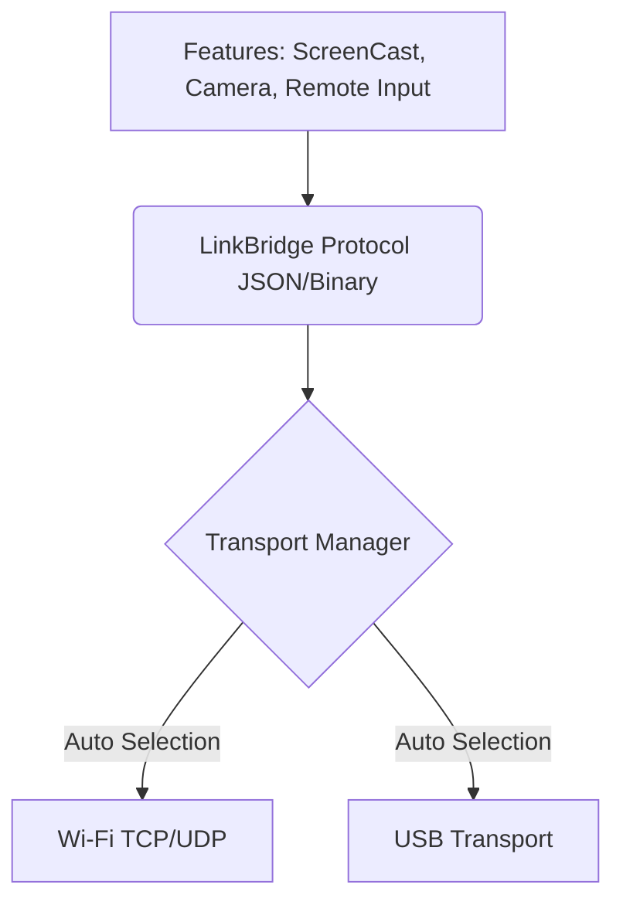

# LinkBridge Architecture

## Core Philosophy
LinkBridge separates the **Transport Layer** from the **Feature Layer**.

## Windows Desktop
- **UI:** WPF with XAML, built on .NET 8.
- **Architecture:** MVVM.
  - `Views/`: XAML pages and windows.
  - `ViewModels/`: Presentation logic.
  - `Services/`: Business logic, connection management, feature handling.
  - `Protocol/`: JSON serialization/deserialization.

## Android App
- **UI:** XML Layouts / Jetpack Compose.
- **Architecture:** Clean Architecture with Coroutines.
- **Services:** Foreground services for maintaining connection in the background.

## Security
- All TCP connections post-pairing must be encrypted (TLS or custom AES encryption using the exchanged RSA keys).
- Device pairing requires explicit user approval (QR code or UI prompt).
